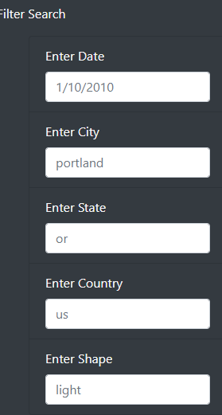
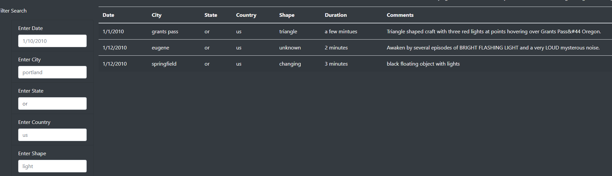
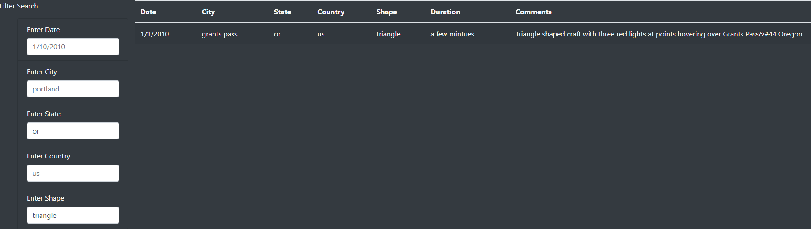

# UFOs - Sightings

# Overview

 The project is to create a website that allows not only the UFO data to be displayed on a table, but filtered in real-time. A user can filter by date, city, state, country, and type of sighting. 

### Resources
- Javascript and HTML.
- d3 and Bootstrap libraries.

# Results

The website filters user input into the filter search as both individual or combined filters. As shown below, there's placeholder text inside the input boxes. Placeholder text assists the user in knowing which format the input requires. A user will start by noticing the filter options, and start exploring the functionality.

### Figure 1

In figure 1, the filter options are shown. 

### Figure 2

In figure 2, the state filter is being used. 

The user will most likely next explore the ability to input more than one filter. Initially there was a filter button used, but updating the filter in real-time is less confusing for the user.

### Figure 3

In figure 3, the state and shape filter were entered. As seen, "Or" and "Triangle" were used and is shown in the table on the right.

# Summary

## Drawbacks

Like many user inputs filtering data, exact matches are required or no match is returned. For example, if "OR" is typed in as a state filter instead of "or", there won't be any matches returned. While the placeholder does lead the user by haing an example, it could create frustrations quickly. 

## Recommendations

First, fixing the aforementioned drawback by allowing input to match regardless of capitalization. This would be done by using regular expressions. There could also be added flexibility with datetime format by possibly converting it to the correct format.

Second, there could be a deeper connection to the content by adding images within the website related to different shapes of sightings. This would be inserted above the filter and table but below the paragraph section. 
